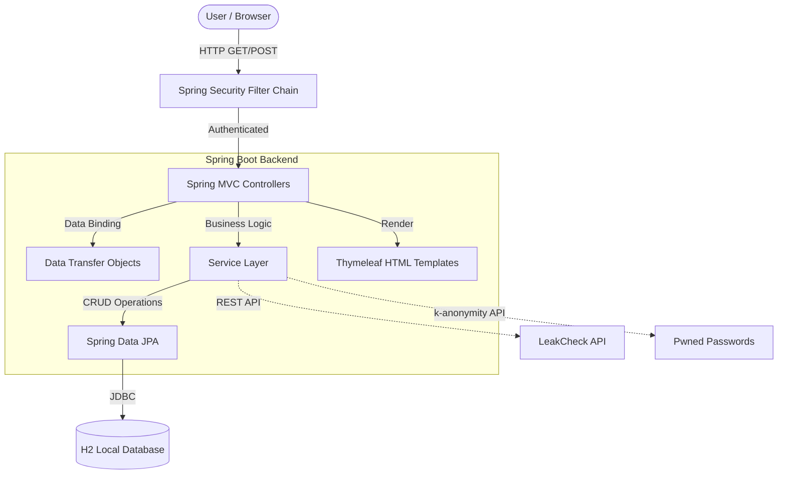

<div align="center">
  <h1>🛡️ BreachGuard</h1>
  <p><strong>Beyond Breach Notification: Educational Cyber-Risk Management</strong></p>
  <p>
    
    
    
    
  </p>
</div>

<br/>

## 📖 Overview

**BreachGuard** is an educational, full-stack cybersecurity dashboard designed to help users understand their digital exposure. Moving beyond simple "you were breached" notifications, BreachGuard calculates personal risk scores, evaluates potential attack chains, simulates dark-web market values, and provides active defense mechanisms like honeypot canary tokens. 

Originally built in Python (Flask), the project has been **completely re-architected and migrated to a Java Full-Stack** ecosystem using Spring Boot and Thymeleaf to provide enterprise-grade performance and security.

---

## ✨ Key Features

* 🔍 **Deep Email Breach Checks**: Aggregates breach data using the LeakCheck API. 
* 📊 **Algorithmic Risk Scoring**: Calculates a customized 0-100 risk score based on the specific classes of data exposed (e.g., passwords vs. credit cards) and the recency of the breach.
* 🍯 **Honeypot Canary Tokens**: Generate fake "decoy" credentials. If an attacker attempts to use them on your fake login page (the "Trap"), you instantly capture their IP, location, and browser fingerprint.
* 🔑 **k-Anonymity Password Checks**: Verifies if a password has been compromised using the HaveIBeenPwned API *without* ever sending your actual password over the network (uses SHA-1 hashing prefixes).
* 👨‍👩‍👧‍👦 **Family Monitoring**: Track the exposure of multiple email addresses (family members or aliases) from a single dashboard.
* 🇮🇳 **India-Specific Threat Intel**: A curated feed of major data breaches affecting Indian users and services.
* 📜 **DPDP Act Legal Generator**: Automatically generates formal Data Erasure requests under India's Digital Personal Data Protection (DPDP) Act, 2023.
* 🧹 **Data Broker Hub**: Quick links and difficulty ratings for opting out of major people-search data brokers.

---

## 🏗️ System Architecture

BreachGuard follows a clean Model-View-Controller (MVC) architecture built entirely on the Spring ecosystem.



### 💻 Technology Stack

* **Language**: Java 17
* **Framework**: Spring Boot 3.4.3
* **Security**: Spring Security (BCrypt Password Hashing, CSRF Protection, Auth Filters)
* **Data Access**: Spring Data JPA / Hibernate
* **Database**: H2 (File-based local database)
* **Template Engine**: Thymeleaf (Server-Side Rendering)
* **Frontend**: HTML5, Vanilla CSS3, Bootstrap 5
* **Build System**: Gradle

---

## 🚀 The Java Migration Journey

This project was recently migrated from a Python (Flask/SQLAlchemy) stack to a Java (Spring Boot/JPA) stack. The migration achieved the following improvements:

1. **Type Safety & Maintainability**: Leveraging Java 17's strong typing, records, and robust OOP patterns to reduce runtime errors.
2. **Enterprise Security**: Replaced custom Python decorators with `Spring Security` for robust session management, password encoding, and route protection.
3. **Database Performance**: Transitioned from SQLite/SQLAlchemy to an H2 database managed by `Spring Data JPA` and Hibernate for better transaction management and query optimization.
4. **Build Automation**: Transitioned to `Gradle`, enabling seamless dependency management, testing, and continuous integration via GitHub Actions.

---

## 📸 Screenshots

*(Create an `assets/` folder in your repository and upload your screenshots here to see them rendered!)*

| Dashboard | Email Check |
| :---: | :---: |
|  |  |
| **Honeypot Management** | **DPDP Erasure Generator** |
|  |  |

---

## 🛠️ Getting Started

### Prerequisites
* Java 17 or higher installed on your system.

### Running the Application Locally

1. **Clone the repository:**
   ```bash
   git clone https://github.com/SuhasRam356/breachguard.git
   cd breachguard
   ```

2. **Run the application using the Gradle Wrapper:**
   
   **On Windows:**
   ```powershell
   .\gradlew bootRun
   ```
   **On macOS/Linux:**
   ```bash
   ./gradlew bootRun
   ```

3. **Access the application:**
   Open your web browser and navigate to `http://localhost:8080`

4. **Access the Database Console (Optional):**
   * URL: `http://localhost:8080/h2-console`
   * JDBC URL: `jdbc:h2:file:./data/breachguard`
   * Username: `sa`
   * Password: *(leave empty)*

---

## ⚠️ Disclaimer

This project is built for **educational purposes only**. 
- The risk scoring algorithms and dark-web market value estimations are simulated based on general threat intelligence principles and do not represent guaranteed outcomes.
- Always verify breach findings with official sources like [HaveIBeenPwned](https://haveibeenpwned.com/).
- The DPDP Act letter generator does not constitute formal legal advice.
